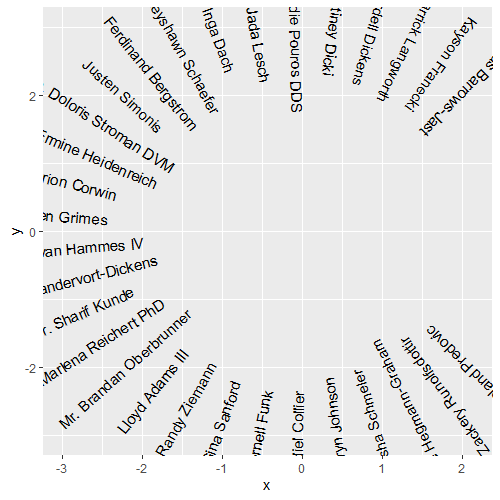
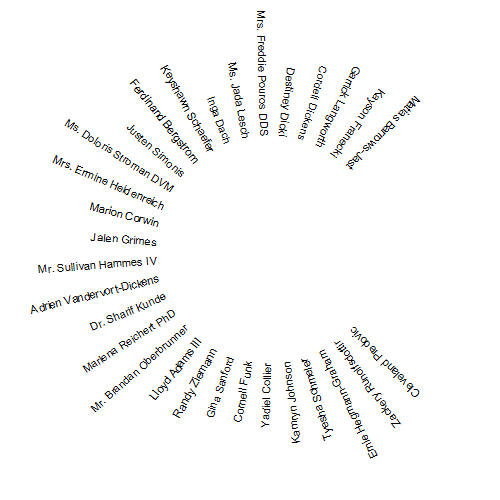
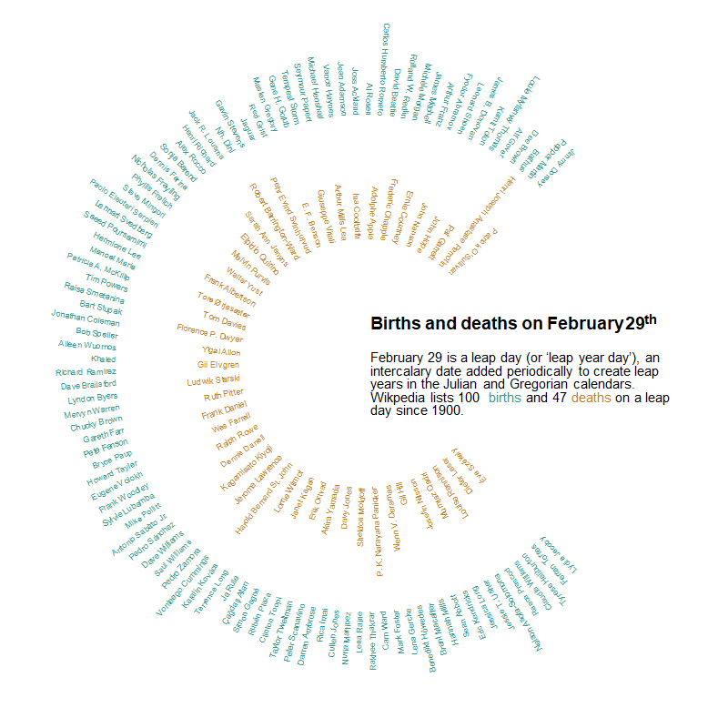

# ggtextcircle

R package to plot text in a (partial or full) circle.

## Example

Generate some data using the {charlatan} package (only required for examples, not required for package):

```r
set.seed(123)
plot_df <- data.frame(name = charlatan::ch_name(n = 30))
```

Basic usage:

```r
ggplot(data = plot_df) +
  geom_textcircle(mapping = aes(label = name))
```



With styling:

```r
ggplot(data = plot_df) +
  geom_textcircle(mapping = aes(label = name), size = 3) +
  scale_x_continuous(limits = c(-6, 5)) +
  scale_y_continuous(limits = c(-6, 6)) +
  coord_fixed() +
  theme_void()
```



A more complex example (uses {ggtext} and {dplyr}):

```r
# read in #TidyTuesday leap Day data
tuesdata <- tidytuesdayR::tt_load("2024-02-27")
births <- tuesdata$births
deaths <- tuesdata$deaths

# Plot
ggplot() +
  geom_textcircle(
    data = dplyr::filter(births, year_birth >= 1900),
    mapping = aes(label = person),
    colour = "#35978f",
    r = 6,
    size = 2.5
  ) +
  geom_textcircle(
    data = dplyr::filter(deaths, year_death >= 1900),
    mapping = aes(label = person),
    colour = "#bf812d",
    r = 3,
    size = 2.5
  ) +
  # annotate with {ggtext}
  ggtext::geom_textbox(
    data = data.frame(x = 0, y = 1.0, label = "Births and deaths on February 29<sup>th</sup>"),
    mapping = aes(x = x, y = y, label = label),
    hjust = 0,
    fontface = "bold",
    lineheight = 0.5,
    fill = "transparent",
    box.colour = "transparent",
    size = 5,
    minwidth = 0.5
  ) +
  ggtext::geom_textbox(
    data = data.frame(
      x = 0, y = -0.5,
      label = glue::glue("February 29 is a leap day (or 'leap year day'), an
                         intercalary date added periodically to create leap
                         years in the Julian and Gregorian calendars. Wikpedia
                         lists {nrow(plot_births)} <span style='color: #35978f;'>
                         births</span> and {nrow(plot_deaths)}
                         <span style='color: #bf812d;'>deaths</span> on a leap
                         day since 1900.")
    ),
    mapping = aes(x = x, y = y, label = label),
    hjust = 0,
    lineheight = 0.5,
    fill = "transparent",
    box.colour = "transparent",
    size = 4,
    minwidth = 0.45
  ) +
  scale_x_continuous(limits = c(-8, 8)) +
  scale_y_continuous(limits = c(-8, 8)) +
  coord_fixed() +
  theme_void()
```


